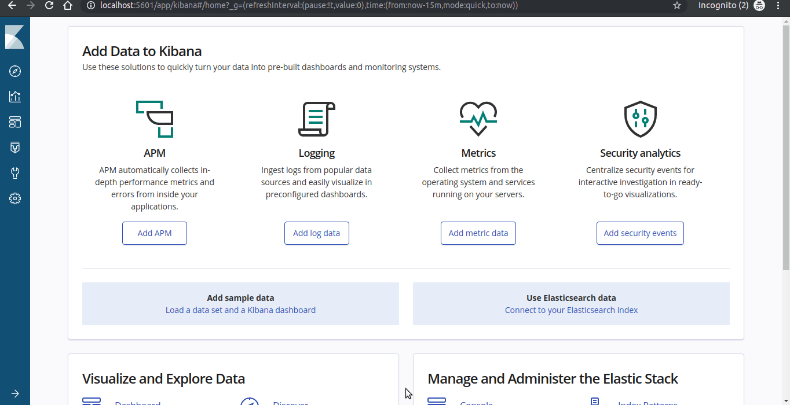

# Description
Setup which shows the following ideas
  - Sending nginx logs to elasticsearch via fluentd and viewing in kibana.
  - Sending the nginx logs to kafka, store the extracted data in mongodb, watch for changes in node.js socket.io server via mongodb changestreams, send events to front end via socket.io connection.

Its just a demo application.
## Prerequisites
  - Docker
  - Minikube
  - Kubectl
  - Helm
  - Terraform
## Screencasts
  - Setup and Teardown
[](https://asciinema.org/a/256791)
  - Worflow

## Components
  - nginx-logs-producer
    - nginx, fluentd with elasticsearch and kafka plugins
    - fluentd takes nginx logs and sends to elasticsearch and kafka
  - kafka-nginx-consumer
    - subscribes to the nginx-access topic
    - Upon receiving messages, parses and stores in mongodb
  - realtime-publisher
    - node.js socket.io server which listens to mongodb changestreams and emits the changes to socket
  - realtime-viewer
    - html page which have socket.io client listens for event and updates the table of nginx events
  - kibana
    - logs which are sent to elasticsearch, are viewed in kibana
## Docker
  - Prebuild images - Dockerhub
    - aravindkumars/realtime-viewer:1.0
    - aravindkumars/kafka-nginx-consumer:1.0
    - aravindkumars/nginx-fluentd:1.0
    - aravindkumars/nginx:1.0
  - Building docker images
    - realtime-viewer
```sh
cd realtime-viewer
docker build -t aravindkumars/realtime-viewer:1.0 -t aravindkumars/realtime-viewer:latest . 
docker push aravindkumars/realtime-viewer:1.0
docker push aravindkumars/realtime-viewer:latest 
```
    - kafka-consumer
```sh
cd kafka-consumer
docker build -t aravindkumars/kafka-nginx-consumer:1.0 -t aravindkumars/kafka-nginx-consumer:latest . 
docker push aravindkumars/kafka-nginx-consumer:1.0
docker push aravindkumars/kafka-nginx-consumer:latest 
```
    - nginx-fluentd
```sh
cd fluentd-docker
docker build -t aravindkumars/nginx-fluentd:1.0 -t aravindkumars/nginx-fluentd:latest . 
docker push aravindkumars/nginx-fluentd:1.0
docker push aravindkumars/nginx-fluentd:latest 
```
    - nginx
```sh
cd nginx-docker
docker build -t aravindkumars/nginx-docker:1.0 -t aravindkumars/nginx-docker:latest . 
docker push aravindkumars/nginx-docker:1.0 
docker push aravindkumars/nginx-docker:latest 
```
## Terraform
  - Directory 
```sh
cd terraform/
```
  - Prerequisites
    - Change the backend in main.tf
    - Change the kubernetes and helm providers in main.tf
  - Backend Consul setup
    - based on the consul container ip view in browser. ex: http://172.17.0.2:8500
```sh
docker run -d --name=dev-consul -e CONSUL_BIND_INTERFACE=eth0 consul
```
  - Docker images
    - Change the docker images in variables.tf
  - Infra setup
```sh
terraform init
terrafor apply
```
  - Infra teardown
    - after destroying using terraform, need to manually delete persistent volumes. below command deletes all the pvc. use it carefully
```sh
terraform destroy
for i in $(kubectl get pvc -o go-template --template "{{ range .items }} {{ .metadata.name }} {{ end }}"); do kubectl delete "pvc/${i}"; done
```
## Workflow
  - Forward kibana port and view in browser http://localhost:5601
```sh
export KIBANA_POD_NAME=$(kubectl get pods --namespace default -l "app=kibana,release=kibana" -o jsonpath="{.items[0].metadata.name}")
kubectl port-forward --namespace default $KIBANA_POD_NAME 5601:5601
```
  - Get NodePort for nginx and replace the minikube ip
```sh
minikube ip
terraform output logs_producer_url
```
  - Get NodePort for realtime viewer and replace the minikube ip
```sh
minikube ip
terraform output realtime_viewer_url
```
### Todo
  - Need to configure the polling times of various components. Since, its taking more time to load and view the data.
# Repos
  - Github - https://github.com/aravindkumarsvg
  - Github Gists - https://gist.github.com/aravindkumarsvg
  - Dockerhub - https://hub.docker.com/u/aravindkumars
  - Vagrant Boxes - https://app.vagrantup.com/aravindkumarsvgj
  - Asciinema - https://asciinema.org/~aravindkumarsvgm